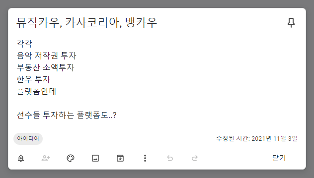
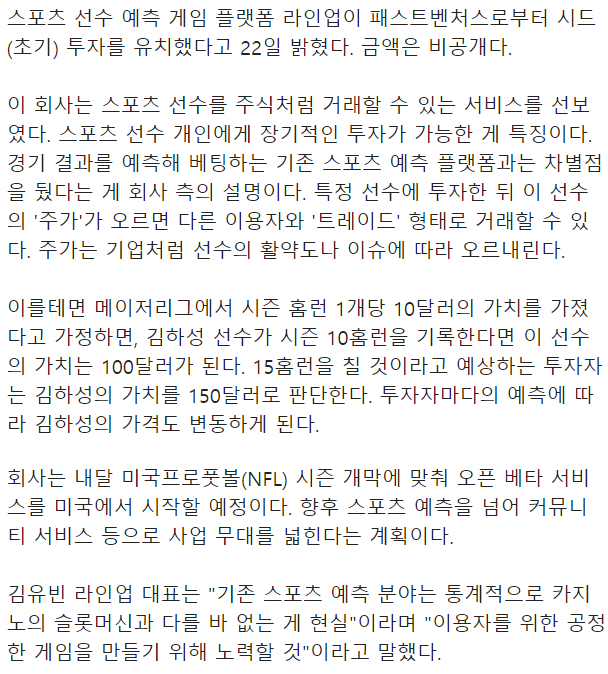

## 라인업
+ 선수 투자 플랫폼
+ 개인이 선수의 기록이나 그런 것 부터 해서 투자할 수 있는 플랫폼이다.
+ 이것도... 내가 2022년도 1학기 팀프로젝트 때도 그렇고, 연구실 있을 때 생각했던 아이디어 중 하나다.

   

  

+ 연구실에 있을 때 혹은 시험기간? 일때, 즉 무언가에 얽매여 있을 때 이런 아이디어가 떠오르는 것도 같다. 현재 상황에서 벗어나고 싶은 감정이랄까? 그런것들이 극대화 되면서 아이디어가 떠오르는걸까?

> [라인업 관련 기사](https://www.hankyung.com/it/amp/202208227972i)
> 

- 이로써 확실히 느껴지는 건...
- 아이디어가 떠올랐을 때 바로 만들어낼 수 있는 제작 능력을 갖추어야겠다.