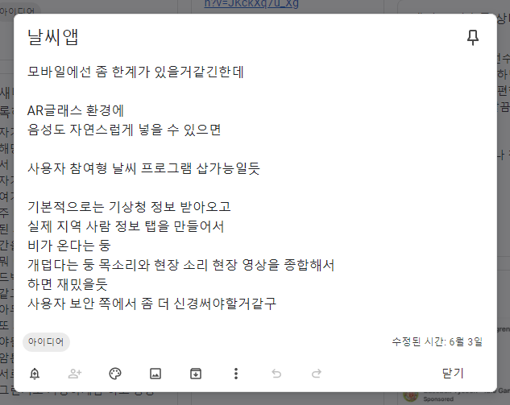
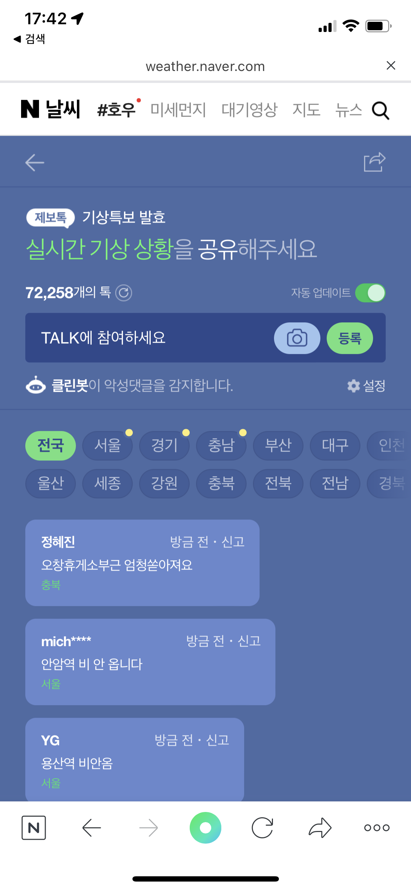

## 네이버 참여형 날씨 '제보톡'
+ 참여형 날씨 정보 제공
+ 내 구글 Keep 메모 목록을 보면 22년도 6월 3일에 작성한 '날씨앱' 아이디어와 거의 유사하다.  

   

 

- 8월에 네이버에서 해당 기능이 나오고 내가 생각했던게 실제로 서비스가 되고 있는걸 보니 신기하면서도 자극이 되었다.  
  

  

 

- 라벨(정확한 용어 찾기)별로 '전국'부터 각 도시별 채팅기능이 있었고 캡쳐본을 보니 사진도 첨부할 수 있는 기능이 있었던거 같다. 
- 네이버 정도의 사용량 정도 되면 확실히 많은 사람들이 이용할 것 같다.  
